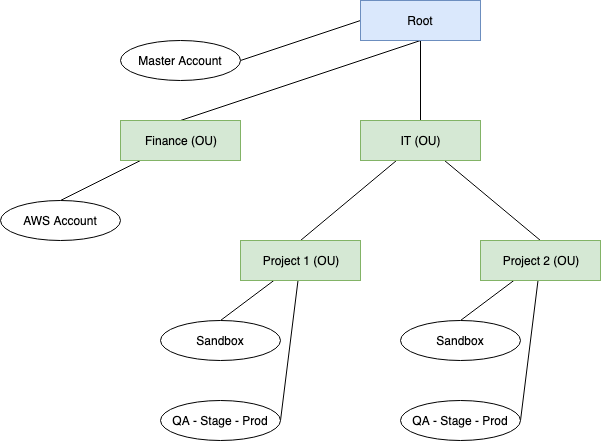

AWS Account Management
==============================================================================

对于个人用户, 你的 Amazon 购物网站的账户, 就是你的 AWS Root 账户, 这个非常简单. 我们重点讨论一下企业用户如何管理 AWS 账户.

首先我们要知道的是, 一个 Amazon 账户下的资源是有限制的, 比如默认状态下最多能创建 5 个 EIP IPV4 地址, 最多能创建 100 个 S3 Bucket, 最多创建 200 个 CloudFormation Stack, 等等, 如果要提高这些限制, 你需要联系 AWS 提高这些限制. 所以对于企业用户, 一个企业不可能只有 1 个 AWS 账户.

在进入企业用户的 AWS 账号管理之前, **首先, 我们来了解一下 AWS Account 和 AWS Organization 的一些基本概念**.

- Ref: https://aws.amazon.com/cn/blogs/china/aws-organizations-multi-account-management/

- Organization - 组织: 一系列的 AWS 账户.
- AWS account – 账户: 单个 AWS 账户.
- Master account – 主账户: 在组织中为所有账户付款的账户, 管理你的组织的中心节点.
- Organizational unit (OU) – 组织单元: 逻辑上的 子 Organization, 由多个 AWS 账户组成, 跟 AWS 账户是 多对多 的关系.
- Administrative root – 管理根: 管理根是整理AWS账户的起始点, 也是整个组织层次架构中的最顶层的容器.
- Organization control policy (OCP) – 组织控制策略: 定义您要应用于某个 Organization 或 OU 的 AWS账户的控制策略. 而具体的 Poilicy 叫做 Service Control Policies (SCP), OCP 是一个概念, SCP 是 OCP 的一个实例.

.. image:: https://d2908q01vomqb2.cloudfront.net/472b07b9fcf2c2451e8781e944bf5f77cd8457c8/2018/01/23/0122-2.png

所以, 假设你是一个初创企业, 你的 AWS 账户管理应该是这样的:

简单来说, **OU 的设置最好跟行政组织结构一致. 而相互之间需要通过内网通讯的项目, 最好放在同一个 AWS 账户下**. 而相互之间需要通过公网通讯的项目, 可以不放在不同的 AWS 账户下.

**权限控制**:

子 OU 会从母 OU 继承 Policy. 而在某个 OU 下的 AWS 账户中的 IAM User 和 Role 的最终权限, 由 OU 的 SCP 以及 IAM User / Role 的 Policy 共同决定. 例如: OU 允许你控制 A, B 服务, 而 IAM 允许你控制 B, C 服务, 那么你只能控制 B 服务.
