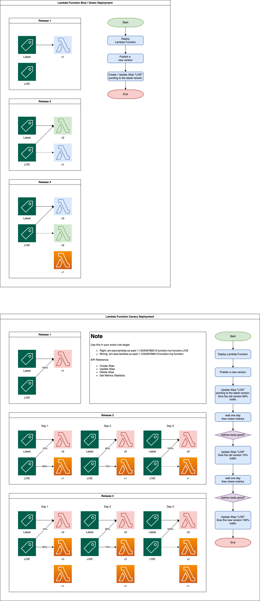

AWS Lambda Function Versions and Alias For DevOps
==============================================================================

What's the Challenge
------------------------------------------------------------------------------
和普通的 App 运维一样, Lambda Function 作为微服务架构的计算单元, 也需要进行版本管理, 包括新版本的发布, 旧版本的回滚, 蓝绿部署, 灰度发布, A/B Test 等等. 从传统运维转过来新接触的运维人员通常不知道如何用 AWS 原生的方式进行 Lambda Function 的运维.

1. 新版本的发布
2. 旧版本的回滚
3. 蓝绿部署
4. 灰度发布
5. A/B Test

Versions and Alias
------------------------------------------------------------------------------
**Version**

Version 是 AWS Lambda 用来管理 Immutable Deployment 的工具. 所谓 Immutable Deploy 是指当一个 App 被部署后, 它就是不可变更的. 你可以这么理解, 如果一个部署可以变更, 那么你用来灾难恢复德时候回滚到历史版本的时候, 你怎么知道这个部署是好的? 因为它完全可能刚部署的时候是好的, 不过之后被改变了. 所以保证部署是不可变更的是现代运维的基本准则.

当你修改 Lambda 的 Settings 和更新 Source code 的时候, 你永远是再 $LATEST 上操作的. 而你随时可以将 $LATEST 的当前状态发布一个 Version. 这跟 TrunkBase 开发的理念一致, 保证 $LATEST 永远是可部署的. 一个 Version 本质上是一个 $LATEST 当前状态的的快照, 包括了代码和设置. 一个 Version 是从 1 开始自动增加的数字. 而指向特定的 Version 的 ARN 的格式是这样子的 ``arn:aws:lambda:us-east-1:123456789012:function:my-function:1``.

**Alias**

由于 Version 是一个无意义的数字, 所以你可以创建一个指向一个具体 Version 的 Alias. Alias 可以是任何字符串, 但一般我们会用 ``LIVE`` 来表示目前正在处理生产流量的 Lambda. Version 指向的是一个不可变的资源, 而 Alias 是一个可变的指针, 这就大大提升了部署时的灵活度. Alias 的 ARN 的格式是这样子的 ``arn:aws:lambda:us-east-1:123456789012:function:my-function:LIVE``.

How to Use Versions and Alias for Deployment
------------------------------------------------------------------------------
有了对 Versions 和 Alias 的基本了解, 很直观的我们就能想到, 我们在部署应用的时候, 不应该用 ``arn:aws:lambda:us-east-1:123456789012:function:my-function`` 这样默认指向 ``$LATEST`` 的 ARN, 而应该用 ``arn:aws:lambda:us-east-1:123456789012:function:my-function:LIVE`` 指向特定的 Alias 的 ARN. 我们可以在 API Gateway, Event Mapping 等各种地方使用这个 ARN.

而每次我们发布新版本的时候, 都创建一个 Version, 我们可以通过改变 Alias 到 Version 的指向关系, 就可以在不重新部署的情况下, 轻松的实现 蓝绿部署, 灰度部署等功能.

**Blue / Green Deployment**

每次部署时, 都创建一个 Version, 然后将 Alias 指向最新创建的 Version. 那么新的 Version 就是 Blue, 旧的就是 Green. 你想要回滚到之前的版本就只要更新 Alias 即可.

**Canary Deployment**

AWS Lambda 有一个功能就是让 Alias 将流量按照概率分发给两个 Version (最多两个). 也就是你发布了新版本的时候, 你可以先将 10% 的流量给新版本, 90% 的流量给旧版本. 等 1 天之后确认各项指标稳定之后, 修改为 90% 的流量给新版本, 10% 的流量给旧版本. 再等 1 天之后将所有的流量给新版本即可. 这期间出现任何问题都可以将流量重新导向旧版本.

A/B Test
------------------------------------------------------------------------------
对微服务进行 A/B Test 看看到底哪个效果好是一个很常见的需求. 做 A/B Test 的时候, 一定要设计指标, 也就是说给一个输入, 用户反馈之后要能计算出若干指标. 最后将用 A 和 B 版本的指标结果进行比较, 从而得出哪个版本更好. 但这里有个坑是, 有些输入是需要用户进行反馈的, 而一般用户不可能帮你用 A/B 都测一遍. 有的时候输入是可以自己模拟在 A/B 上都跑一遍的, 这种情况我们不考虑, 因为你如果能自己跑一边, 你的 A/B Test 就完全可以自己在发布之前就跑一边, 根本不需要用户的反馈.

所以我们做 A/B 的时候, 一定要进行合理的实验设计, 减少偏见. 例如根据一个用户平均跟你的系统互动 10 次. 你可以说让这个用户的 10 次互动平均分配给 A/B. 这样可以看出来对于同一个用户的输入, 哪个更好. 你也可以说让一个用户的所有流量都经过 A, 另一个用户的所有流量都经过 B. 但这样可能会出现你看 Metrics B 的效果要比 A 好, 但是这可能是因为用户群本身的特征导致的, 跟你的 A/B 无关. 所以我们需要根据业务具体分析. 例如 tiktok 推荐算法这种应用, 由于你的目的是优化已有的推荐算法, 你就需要让同一个用户的互动平均分配, 来看哪个的推荐效果好. 而例如电商业务中为了拓展新的用户群, 探索新商业模式, 那么你可能需要根据用户的特征, 例如花钱少的人都由 A 来处理, 而花钱多的大客户都有新算法 B 来处理.
