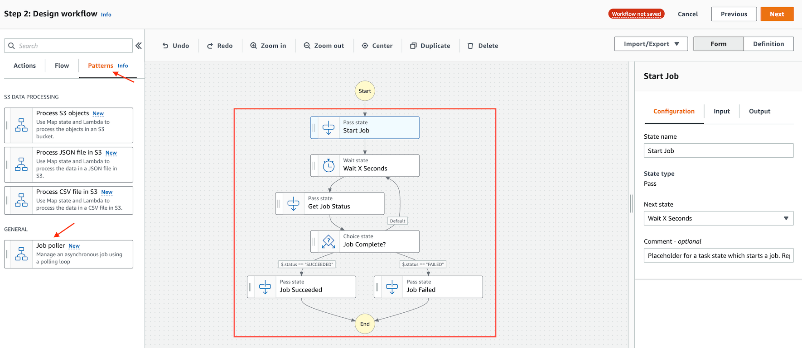
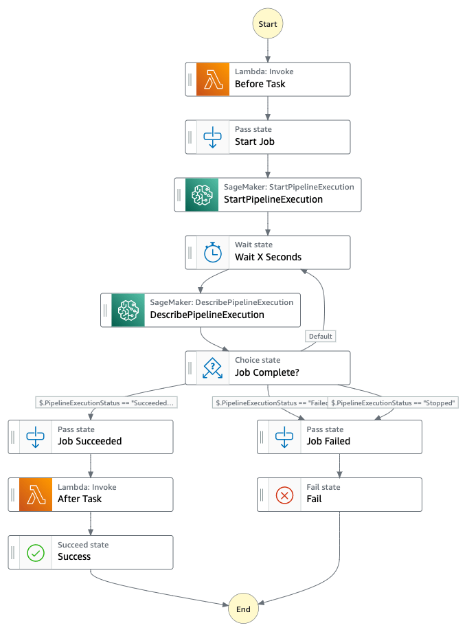

.. _aws-step-function-convert-async-to-sync-call:

Convert Async to Sync Call
==============================================================================
Keywords: AWS Step Function, StepFunction, SFN, State Machine, StateMachine

Summary
------------------------------------------------------------------------------
作为一个 Orchestration Tool, 处理需要长时间运行的 Job 是一个常见问题. 通常凡是需要长时间运行的 Job, 例如 Glue Job, ECS Task, 需要长时间的 Lambda Function, 都会提供 Async API. 所谓 API 就是 你运行 API 后就开始运行了, 但是你调用这个 API 的程序就可以继续后面的工作了. 但是在 Orchestration 中你常常需要知道这个 Async 的 Call 最后的结果才能决定之后的步骤. 如果这个 API 还有 Sync 的版本那当然是最好, 可是很多时候这种长时间运行的 Job 根本就不会提供 Sync 的 API. 这种情况下往往开发者会用 long poll (长轮询) 模式实现, 也就是隔一段时间 (10 几秒) 就去用 API 查询一下 Status, 看看目前的状态如何, 然后设置一个 Time Out, 超过多长时间如果一直是 processing 没有到达一个确定成功或失败的结果, 就当成失败处理.

**接下来我们来讨论一下在 AWS StepFunction 中这种情况应该如何处理**

The High Level Overview of the Solution
------------------------------------------------------------------------------
总体思路就是在 StepFunction Visual Editor 里有一个 Patterns 的选项卡, 里面有一个叫 `Job Poller <https://docs.aws.amazon.com/step-functions/latest/dg/sample-project-job-poller.html>`_ 的模式, 实现了运行后隔一段时间就检查一下 Status 这种模式. 你只要在 Visual Editor 里找到对应 Start Job 和 Get Status 的 API Widget, 定义好 Input / Output 以及在 ``Job Complete?`` 这个 Task 里用 JSON Path 获得 Status 的值并对其做判断即可. Default 的 Input / Output 就已经很不错了, Wait 会把从 Start Job API 中获得的参数 (通常是你的 Job 运行者的资源地址) 一直在循环中传递. 下图是对这种模式的一个抽象:

接下来我们用一个实际例子来演示. 这里我们的 Job 是 SageMaker Pipeline. SageMaker Pipeline 是 AWS 用来做 ML 的 Orchestration Tool, 本质就是一个 ML 专用的 StepFunction, 等于我们这里是在 StepFunction 里嵌套 StepFunction 了. 并且这个 Run Pipeline 的 API 没有 Sync 模式, 是一个很好的例子. 这里我们用了 ``StartPipelineExecution`` 的 API, 它会返回一个 Execution ARN, 作为后面 ``DescribePipelineExecution`` API 的输入. 然后再 ``Job Complete?`` 中用 ``$.PipelineExecutionStatus`` 获得 Status 的值然后做判断. 我们在 ``Start Job`` 前以及 ``Job Succeeded`` 之后各有一个 Lambda Function Task, 用于模拟实际情况.

这里有两个坑要注意:

1. ``DescribePipelineExecution`` 需要从 ``StartPipelineExecution`` 的结果来获得 Execution ARN, 这里的 Parameter 里 ``PipelineExecutionArn`` 不能是 Hard Code Path, 而要是 ``PipelineExecutionArn.$``. 你可以 `参考原始文档 <https://docs.aws.amazon.com/step-functions/latest/dg/input-output-inputpath-params.html#input-output-parameters>`_ 中的这段话 "For key-value pairs where the value is selected using a path, the key name must end in .$."

.. code-block:: javascript

    {
      "PipelineExecutionArn.$": "$.PipelineExecutionArn"
    }

2. ``DescribePipelineExecution`` API 具体的输出的 JSON 的格式是怎样的, Status 在哪个 Key 下我们是不知道的. 这个在 API Spec 文档里有但是很难找. 一个简单的办法就是直接试着运行一次, 然后让它直接 fail, 通过查 Execution Log 中的 Output 来了解 JSON 的具体格式.

.. code-block:: javascript

    {
      "StartAt": "Prepare Data",
      "States": {
        "Prepare Data": {
          "Type": "Task",
          "Resource": "arn:aws:states:::lambda:invoke",
          "OutputPath": "$.Payload",
          "Parameters": {
            "Payload.$": "$",
            "FunctionName": "arn:aws:lambda:us-east-1:111122223333:function:prepare-data:$LATEST"
          },
          "Retry": [
            {
              "ErrorEquals": [
                "Lambda.ServiceException",
                "Lambda.AWSLambdaException",
                "Lambda.SdkClientException",
                "Lambda.TooManyRequestsException"
              ],
              "IntervalSeconds": 2,
              "MaxAttempts": 6,
              "BackoffRate": 2
            }
          ],
          "Next": "StartPipelineExecution"
        },
        "StartPipelineExecution": {
          "Type": "Task",
          "Parameters": {
            "ClientRequestToken": "f1048be316aab7153fb0b5c266359571",
            "PipelineName": "my-sagemaker-pipeline"
          },
          "Resource": "arn:aws:states:::aws-sdk:sagemaker:startPipelineExecution",
          "Next": "Wait 10 Seconds"
        },
        "Wait 10 Seconds": {
          "Type": "Wait",
          "Next": "DescribePipelineExecution",
          "Seconds": 10
        },
        "DescribePipelineExecution": {
          "Type": "Task",
          "Next": "Job Complete?",
          "Parameters": {
            "PipelineExecutionArn.$": "$.PipelineExecutionArn"
          },
          "Resource": "arn:aws:states:::aws-sdk:sagemaker:describePipelineExecution",
          "InputPath": "$"
        },
        "Job Complete?": {
          "Type": "Choice",
          "Choices": [
            {
              "Variable": "$.PipelineExecutionStatus",
              "StringEquals": "Failed",
              "Next": "Fail"
            },
            {
              "Variable": "$.PipelineExecutionStatus",
              "StringEquals": "Succeeded",
              "Next": "Job Succeeded"
            },
            {
              "Variable": "$.PipelineExecutionStatus",
              "StringEquals": "Stopped",
              "Next": "Fail"
            }
          ],
          "Default": "Wait 10 Seconds"
        },
        "Job Succeeded": {
          "Comment": "Placeholder for a state which handles the success.",
          "Type": "Pass",
          "Next": "Deploy Model"
        },
        "Fail": {
          "Type": "Fail"
        },
        "Deploy Model": {
          "Type": "Task",
          "Resource": "arn:aws:states:::lambda:invoke",
          "OutputPath": "$.Payload",
          "Parameters": {
            "Payload.$": "$",
            "FunctionName": "arn:aws:lambda:us-east-1:111122223333:function:deploy-model:$LATEST"
          },
          "Retry": [
            {
              "ErrorEquals": [
                "Lambda.ServiceException",
                "Lambda.AWSLambdaException",
                "Lambda.SdkClientException",
                "Lambda.TooManyRequestsException"
              ],
              "IntervalSeconds": 2,
              "MaxAttempts": 6,
              "BackoffRate": 2
            }
          ],
          "Next": "Success"
        },
        "Success": {
          "Type": "Succeed"
        }
      }
    }

The Wait for Callback token Pattern
------------------------------------------------------------------------------
有的时候你的 Job 根本就不是 AWS 的服务, 也不存在 Check Status 的 API 的情况, 这时候你就无法用上面的 Job Poller 模式了. 这个时候就要使用 `Wait for Callback token <https://docs.aws.amazon.com/step-functions/latest/dg/connect-to-resource.html#connect-wait-token>`_ 来解决.

该方法的本质就是在运行 Task 之后一直等待到 Timeout, 直到你用 `SendTaskSuccess <https://docs.aws.amazon.com/step-functions/latest/apireference/API_SendTaskSuccess.html>`_ 或 `SendTaskFailure <https://docs.aws.amazon.com/step-functions/latest/apireference/API_SendTaskFailure.html>`_ 将这个 Token 发给 StepFunction 即可 (这个 Token 是全局生效的, 你无需指定 Execution ARN). 在这种模式下, 通常 Start Job 是由 Lambda 发起的. StepFunction 中的每个 Task 都有一个唯一的 Token, 你可以在 Context Object 里用 ``$$.Task.Token`` 来获得这个值. 如果你的这个 Task 是一个非 AWS 服务, 你可以将 Token 存在数据库中然后用你的 Task 来读这个 Token. 简单来说就是 Start Job 的 Lambda 的末尾把 Token 写入数据库, 然后在你的 Job 完成之后, 用 API 把这个 Token 发回给 StepFunction.

- Wait for Callback token 的工作原理: https://docs.aws.amazon.com/step-functions/latest/dg/connect-to-resource.html#connect-wait-token
- 一个使用 Callback token 的具体例子: https://docs.aws.amazon.com/step-functions/latest/dg/callback-task-sample-sqs.html
- Context Object 详解, 这个跟如何获得 Token 的值有关: https://docs.aws.amazon.com/step-functions/latest/dg/input-output-contextobject.html
