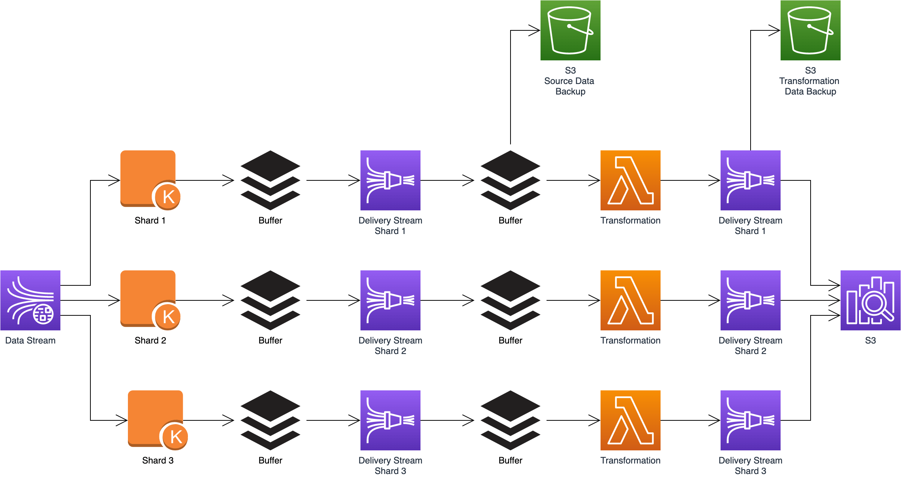

.. _aws-kinesis-firehose-delivery-stream-basic:

AWS Kinesis Firehose Delivery Stream Basic
==============================================================================
Keywords: Kinesis Firehose Delivery Stream Basic, Root

.. contents::
    :class: this-will-duplicate-information-and-it-is-still-useful-here
    :depth: 1
    :local:

What is Delivery Stream
------------------------------------------------------------------------------
Delivery Stream 是一种特殊的 Stream. 他的功能专注于将数据从 Source, Delivery 到 Destination. 本质上 Delivery Stream 就是一种特殊的 **Consumer**. 它主要有两种应用场景.

1. 将数据做简单的 Transformation, 然后 delivery 到 Destination. 比如 到 S3, 到各种 Database, Third Party Cloud Data Dog, Splunk, ELk.
2. 用 AWS Lambda 实现自定义的高并发 Consumer. 免去了维护 Consumer 的部署的麻烦.

Ref:

- https://docs.aws.amazon.com/firehose/latest/dev/what-is-this-service.html

How it Work
------------------------------------------------------------------------------
我们知道 Kinesis Data Stream 底层有很多个 Shard. 每个 Shard 负责一定量的数据. 而 Kinesis Delivery Stream 的内部也是有很多 Shard. 你可以将其理解为一个 Delivery Stream 的计算逻辑对应一个 Container 中的代码. 一个 Container 就是一个 Consumer. Delivery Stream 为每个 Shard 都配了一个 Consumer. 然后这个 Consumer 就会完成数据的 delivery, 如果其中有 Transformation 的需求, 那么 Transformation 的逻辑会在 AWS Lambda 处理完成. 所以整个流程看起来是像这样子:

    Kinesis Data Stream
    ->
    Data Stream Shard
    ->
    delivery stream buffer
    ->
    Delivery Stream Shard
    ->
    lambda buffer
    ->
    Lambda Transformation data

Data Stream 和 Delivery Stream 的区别
------------------------------------------------------------------------------

- Data Retention:
    - Data Stream: 数据会持久化保存一段时间
    - Delivery Stream: 数据只是经过, 并不保存
- Distributive: 两者都是分布式系统
    - Data Stream: 在 write 的时候, producer 无需管理要写到哪个 node 上, stream 会根据 partition key 自动决定, 在 read 的时候, 需要决定从哪个 shard 上读取数据. 一次 API 调用只能从一个 shard 上读取数据.
    - Delivery Stream: 可以理解为一个 Data Stream 的 consumer, 你无需决定从哪个 shard 上读取数据, 所有 shard 上的数据都会被聚集起来, 写入 buffer 中, 然后传递给下游 consumer. 相当于你无需自己实现 Data Stream Consumer 中那复杂的管理 shard 的逻辑了. Delivery Stream 本身的 shard 对用户不可见.

Dynamic Partitioning
------------------------------------------------------------------------------
Dynamic Partitioning 功能只针对 Destination 是 S3 的情况. 在大数据领域, 把数据存储在 S3 上的时候通常会有多个 partition key, 例如 year, month, day. 如果你给你的每个 record 加上了 partition key 和 value, 那么 Delivery Stream 就会在将数据写入 S3 的时候自动将数据放在不同的 partition prefix 下.

Dynamic Partitioning 这个功能默认是关闭的. 你需要显式启用.

Delivery Stream 会给每个 Partition 分配一个 buffer, 这个 buffer 的大小是 64 ~ 128 MB 以及 60 ~ 900 seconds. 先满足大小和时间中的任何一个, Buffer 中的数据就会被发送到下游. 默认是 128 MB / 900 seconds. 每个 Partition 最大的写入 throughput 是 25MB / second.

如果每秒钟创建 3 个 partition, buffer hint 是 60, 那么总计同时会有 180 个 concurrent active partition. 一个 delivery stream 最多有 500 个 active partition 的 quota, 如果要提高这一上线, 可以给 AWS 客服提交请求.

Ref:

- https://docs.aws.amazon.com/firehose/latest/dev/dynamic-partitioning.html
