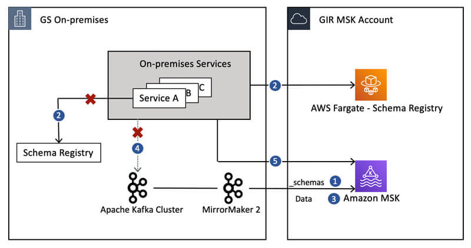

高盛的 Kafka to AWS MSK 迁徙经验
==============================================================================
本文是自己阅读 AWS Blog 的这篇文章的翻译和理解.

Ref:

- https://aws.amazon.com/blogs/big-data/how-goldman-sachs-migrated-from-their-on-premises-apache-kafka-cluster-to-amazon-msk/

- Global Investment Research (GIR) 是高盛的一个部门.

Migration options
------------------------------------------------------------------------------
Option 1

执行一个 Atomic 的 cutover 让所有依赖 Kafka 的服务都在同一时间切换到 Amazon MSK. 这需要一个 maintenance window, 也就是有 downtime. 所有服务在此期间下线.

Option 2

让依赖 Kafka 的服务一个个慢慢的切换到 AWS MSK, 也就是期间肯定有部分服务依赖 Kafka, 有部分依赖 MSK.

最终 GIR 选择了 1. 1 虽然有 downtime, 但是简单粗暴, 不容易出错.

Apache Kafka MirrorMaker
------------------------------------------------------------------------------
Apache Kafka MirrorMaker 是一个开源工具, 用于在两个 Kafka cluster 之间同步数据. 我们主要讨论 MM2 (2020 年 9 月发布的)

MM2 提供了 replication of messages and topic configurations (配置文件同步), ACLs (Access Console List), consumer groups, and offsets (Offset 同步) between Apache Kafka clusters with either unidirectional or bidirectional mirroring (双向 mirror).

It migrates topic configurations (replication factor and partition count) from the source cluster to the destination cluster. It also enables you to control which topics are mirrored between clusters, as well as the naming pattern used for the mirrored topics. For information about using MirrorMaker with Amazon MSK, see `Migrating Clusters Using Apache Kafka’s MirrorMaker <https://docs.aws.amazon.com/msk/latest/developerguide/migration.html>`_ and the hands-on lab MirrorMaker2 on `Amazon EC2 <https://catalog.us-east-1.prod.workshops.aws/workshops/c2b72b6f-666b-4596-b8bc-bafa5dcca741/en-US/migration/mirrormaker2>`_.

GIR’s migration using Option 1
------------------------------------------------------------------------------

1. GIR 用 Avro Schema 来验证数据结构. Schema registry 是一个 AWS 的服务, 可以让你注册 schema 并用它来验证数据. 这一步至关重要, 因为 on-prem 的 producer 发送 message 之前都要用这个来验证. migration 之前的 on-prem 是没有用 AWS Schema register, 所以你需要保证 AWS schema register 和之前的 schema 保持一致.

GIR uses Avro Schemas and a schema registry to validate the messages published to the Apache Kafka topics. These messages are validated against the registered schema using a schema registry service. Before starting any data migration, GIR hosted a schema registry service in AWS, which they started using for any new and AWS-only hosted applications connecting to Amazon MSK. Before switching any on-premises service connecting to Apache Kafka to use Amazon MSK, GIR migrated all the on-premises schemas to AWS. To accomplish this, GIR did the following:
Deleted the existing _schemas topic on Amazon MSK (after ensuring the services connected to Amazon MSK and the schema registry in AWS were stopped).
Mirrored the _schemas topic and its configuration from on premises to Amazon MSK using unidirectional mirroring with MM2.

