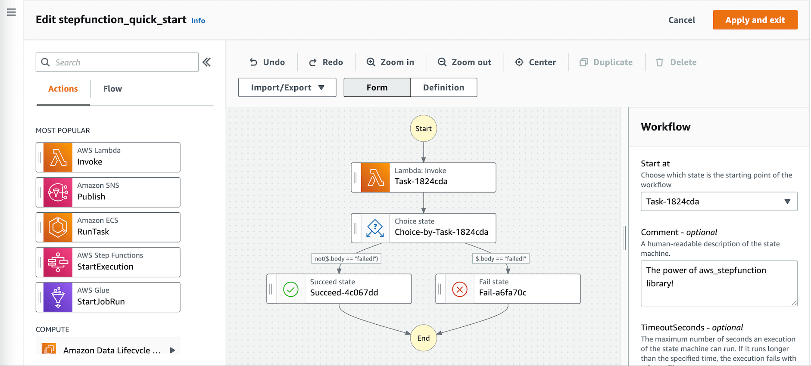
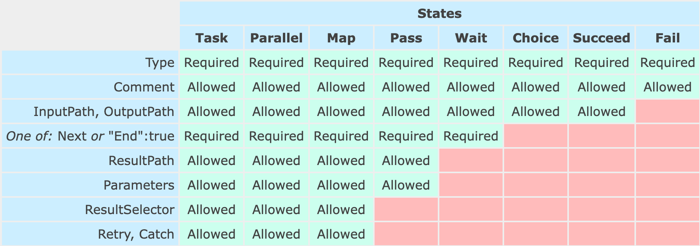

AWS Step Function - Quick Start
==============================================================================

Concept
------------------------------------------------------------------------------
学一门新技术最重要的就是了解其中的概念.

- Action: 一个具体的计算动作, 比如 "运行一个 Lambda Function", "发送一条消息到 SNS Topic" 这些都是 Action, 每个 Action 有它自己的 Input Output 的接口数据模型.
- State: 一个状态, 是对一个 Action 的封装. 也是编排的最小单位. State 本身也有 Input Output, 而 State Input/Output 和 Action Input/Output 之间是可以进行一些简单的数据处理的.
- Transition: 从一个状态转移到另一个状态
- Workflow: 将所有的 State 用 Transition 组织到一起的一个图, 有一个确定的开始, 以及多个结束. 也是我们编排的重点.
- State Machine: 一个 AWS StepFunction Console 中的 Resource, 里面包含了 Workflow Definition, IAM Role, Tag 等等. 是对 Workflow 的一个封装. 你可以 Execute State Machine, 并用图形化界面查看执行状态和结果.
- Choice Rule: 实际上就是一系列逻辑判断的组合, 来根据判断结果决定下一步做什么.
- Logic Flow: 这其实不是 Step Function 中的概念, 而是通用的概念. 其实就是一个图论中的 "图", 里面有 链条, 并行, 分叉, 条件判断 等等元素.

Amazon State Language
------------------------------------------------------------------------------
然后我们就可以开始学习 ASL 这门基于 JSON 的语言, 学习如何精准的定义一个 Workflow.

以下两个文档包含了基本上所有需要的资料.

- https://states-language.net/spec.html
- https://docs.aws.amazon.com/step-functions/latest/dg/concepts-states.html

ASL 中一共有 8 种不同的 State:

- Task: 一个包含具体的 Action 的任务, 有输入输出, 有异常处理.
- Parallel: 并行执行多个子 workflow. 这些子 workflow 相互独立, 并且都有明确的结束节点.
- Map: 用不同的参数并行执行同一个子 workflow.
- Choice: 根据条件判断, 执行不同的逻辑分支.
- Pass: 通常用于输入输出的参数处理, 不执行任务, 只处理数据.
- Wait: 等待一段时间, 或是等待直到某个时间点.
- Succeed: 标记为成功, 并结束.
- Fail: 标记为失败, 并结束.

对于不同的 State 你能做的事情也不同. 例如 Task, Parallel, Map, Pass, Wait 都必须要么结束, 要么有下一个节点. 而 Choice 则没有结束和下一个节点的概念, 因为它的逻辑分支本质上就是一个个的 Task, 这些 Task 有结束和下一个就可以了, Choice 本身是不需要的.

下面这个图可能是最重要的图, 列出了不同的 State 都能做什么事.

Input Output Data Handling
------------------------------------------------------------------------------
我们把这个问题简称为 IO

如果你认真读了 Concept, 你会知道 Action 和 State 虽然非常相似, 但是它们有各自的 Input Output. 而所谓的 IO 就是进行 State Input -> Action Input, 以及 Action Output -> State Input 的转换. ASL 提供了 5 种 IO 的处理方式:

- InputPath:  取 State Input 的一个 JSON Node 作为 Action Input, 适合简单的情况
- Parameters: 用 Payload Template 语法从 State Input 中提取 Action Input, 适合复杂的情况
- ResultSelector: 用 Payload Template 语法从 Action Output 中提取 State Output, 适合复杂的情况
- ResultPath: 直接把 State Input 和 Action Output 合并成一个大 JSON 输出. 常见于把整个 Workflow 的后续的 State 掌握之前所有的 Input Output 的信息的情况
- OutputPath: 去 Action Output 的一个 JSON Node 作为 State Output, 适合简单的情况

下面这张官方图很好的解释了整个流程:

.. image:: https://docs.aws.amazon.com/step-functions/latest/dg/images/input-output-processing.png

Error Handling
------------------------------------------------------------------------------
有些 State 支持 Error Handling. 你可以用 Error Code 来决定, 在出了什么错误的情况下, 进行 Retry, 或是用一个专门的 State 来处理 Catched Error Data. 用 Python 的逻辑来说就是:

.. code-block:: python

    try:
        run_task_state(...)
    except SomeError:
        run_catch_logic(...)

只不过 ``run_task_state`` 和 ``run_catch_logic`` 是两个实际的 Task 而已.
