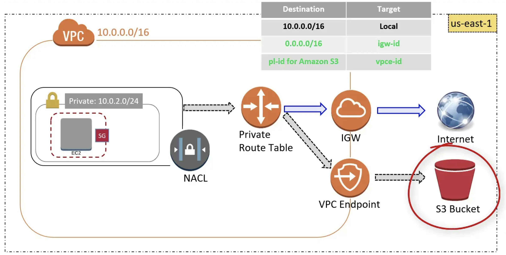

.. _aws-vpc-endpoint:

VPC Endpoint, Private Link
==============================================================================
Keywords: AWS VPC Endpoint, Private Link

.. contents::
    :class: this-will-duplicate-information-and-it-is-still-useful-here
    :depth: 1
    :local:

Private Link is just another name of VPC Endpoint.

简介
------------------------------------------------------------------------------
A VPC endpoint enables you to privately connect your VPC to supported AWS services and VPC endpoint services powered by PrivateLink without requiring an internet gateway, NAT device, VPN connection, or AWS Direct Connect connection. Instances in your VPC do not require public IP addresses to communicate with resources in the service. Traffic between your VPC and the other service does not leave the Amazon network.

默认情况下任何 AWS API 的请求, 我们以 S3 Get / Put Object 为例, 你的 API Request Client 会把请求发给对应的 AWS 服务的公网 Endpoint, 例如 ``s3.amazonaws.com``. 这个请求要通过 DNS 解析走公网路由, 从你的网络服务提供商, 到 DNS 服务器, 城域网, 骨干网, 与网络服务提供商千千万的用户的流量混在一起. 就算你的 AWS API 请求发起的机器是位于 VPC 上的 EC2, 也是一样的.

而 VPC Endpoint 则是在你的 VPC 内为特定的 AWS Service 创建一个物理网关, 这个网关和 AWS Service 之间的通信是走 AWS 内部的网络直连, 而你的 EC2 和这个网关直连. 假设这个网关的 Endpoint 是 ``s3.vpce12345.amazonaws.com``. VPC 内的路由会将所有指向 ``s3.amazonaws.com`` 的流量路由到 ``s3.vpce12345.amazonaws.com``, 这就实现了:

1. 流量不走公网, 保护隐私.
2. 请求直连 AWS Service 的 Endpoint, 速度快.

Ref:

- https://docs.aws.amazon.com/vpc/latest/privatelink/vpc-endpoints.html

VPC Endpoint Types
------------------------------------------------------------------------------
VPC Endpoint 有三种类型:

1. **Interface Endpoint**: An elastic network interface with a **Private IP address** serves as an entry point. e.g. CloudFormation, CloudWatch. 对应的是 AWS 的服务
2. **Gateway Load Balancer endpoint**: is an elastic network interface with a private IP address from the IP address range of your subnet. It serves as an entry point to intercept traffic and route it to a network or security service that you've configured using a Gateway Load Balancer. You specify a Gateway Load Balancer endpoint as a target for a route in a route table. Gateway Load Balancer endpoints are supported only for endpoint services that are configured using a Gateway Load Balancer. 对应的 AWS Load Balancer 服务
3. **Gateway Endpoint**: A gateway is a target for specified route in your **route table**. e.g. S3, DynamoDB. 对应的是 S3 和 Dynamodb, 不过 S3 也支持 Interface Endpoint, 所以这个主要是为 Dynamodb.

所有支持 VPC Endpoint 的 AWS Resource 的列表, 以及他们的 VPC Endpoint 类型. https://docs.aws.amazon.com/vpc/latest/userguide/vpc-endpoints.html

例子, 使用 VPC Endpoint 访问 S3
------------------------------------------------------------------------------

