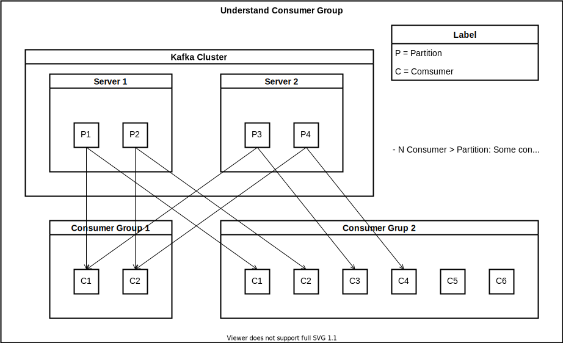

Consumer Group
==============================================================================
Keyword: Kafka, Consumer Group, Partition

1. 每个 Consumer Group 可以包含多个 Consumer, 这些 Consumer 有着相同的 Group Id.
2. 可以有多个 Consumer Group subscribe 一个 Topic. 每一条 Pub 到 Topic 的 Message 都会被 Copy 一份发送给每个 Consumer Group. 也就是有多少个 CG, Message 就会被 Copy 多少份.
3. 每个到达 Consumer Group 的 Message 都只会在 CG 内部消费一次.
4. 具体 CG 内的每个 Consumer 从哪个 Partition 上读取数据是由 ``PartitionAssignor`` 决定的, 内部有两个默认的 Policy, 这里暂时不展开讲.
4. 如果 CG 内的 Consumer 数量可以比 Partition 少 / 多 / 相等. 少的话 Consumer 就会负担超过 1 个 Partition, 多的话最多每个 Consumer 负责一个 Partition 并且多出来的就 Standby. 相等的话就是一对一的关系.
5. 每个 Partition 都会被 CG 内的某个 Consumer 所负责, 这个叫做 Partition Ownership. 如果 CG 内的 Consumer 数量发生变动, 比如 Consumer 挂掉, 增加新的 Consumer, 那么 Partition Ownership 就要发生改变, 这个过程叫做 Re-balance. Re-balance 发生时, CG 会短暂地停止消费,

Ref:

- https://www.oreilly.com/library/view/kafka-the-definitive/9781491936153/ch04.html