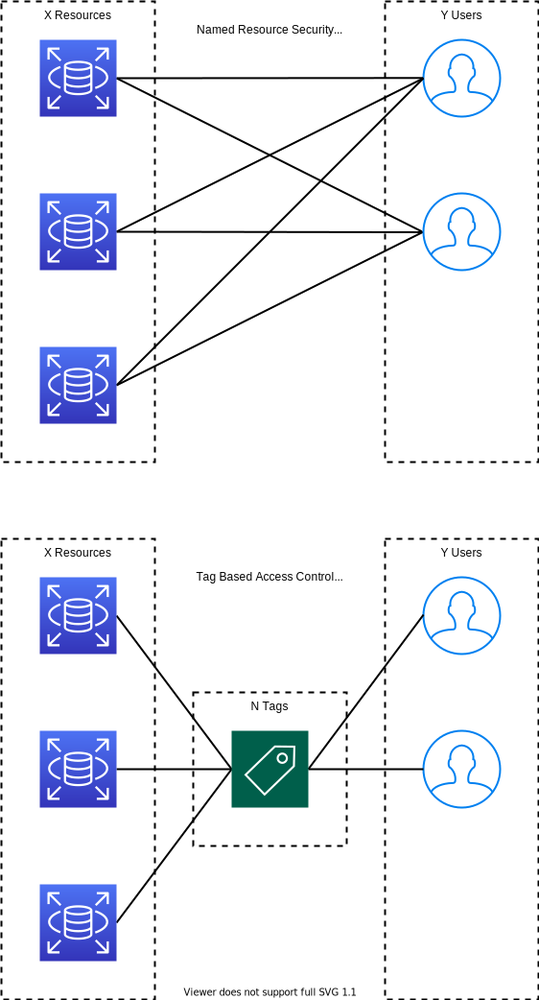

.. _aws-lake-formation-data-access-control-tutorial:

Data Access Control in Lake Formation Tutorial
==============================================================================

.. contents::
    :depth: 1
    :local:

The Nature of Data Access Control
------------------------------------------------------------------------------

Key Concept:

- **Resource**: a data resource, can be database, table, column, file, etc ...
- **Principal**: a data visitor, can be a human, machine, IAM User, IAM Role, etc ...

``Data Access Control`` is all about grant a ``Principal`` to access specific ``Resource``::

    [User] --- access ---> [Database Table]

In AWS World, Lake Formation supports AWS Glue Catalog database / table / column as Resource, IAM User / Role as Principal. Since you can use AWS Glue Catalog to connect to different data source system, such as S3, JDBC database connection, salesforce, etc, you can visit almost anything

Data Access Model in Lake Formation
------------------------------------------------------------------------------

- **Named data catalog resources security**: Grant / Revoke a Principal access to a Resource. This is very similar to the legacy Resource Policy, and also the default model in old AWS Lake Formation.
- **Lake Formation Tag security model**: Define key value pair as Tag, associate one or multiple tag to ``Resource`` and ``Principal``. ``Principal`` automatically gain access to ``Resource`` that matching the Tag.

Pro and Con:

- **Named data catalog resources security**
    - pro:
        - intuitive, easy to understand
    - con:
        - not scale
- **Lake Formation Tag security model**
    - pro:
        - scalable
    - con:
        - harder learning curve

Explain:

If there are X ``Resource`` and Y ``Principal``. With ``Named data catalog resources security`` you need to declare X * Y access policy. With ``Lake Formation Tag security model`` you only need to associate tags to X ``Resource`` and Y ``Principal`` (X + Y).

Example, a financial institution has 5 database, 100 tables, and 1000 human and machine users. Total effort needed:
    - Named data catalog resources security: 100 * 1000 = 100,000
    - Lake Formation Tag security model: 100 + 1000 = 1,100

LF Tag Strategy
------------------------------------------------------------------------------

记住一点, LF Tag 的机制是 只要 Principal 有任意 Resource 的 Tag 中的一个, 就能访问这个 Resource. 而 Associate Tag 的原则是 对于一个 Key 只能有一个 Value, 不能同时把 AccessRole = Admin, AccessRole = Regular assign 给同一个 Resource. 所以这时候有两种设计 LF Tag 的 Strategy.

1. 不同的 Key, Value 无所谓. (推荐)

例如我们创建这么几个 Tag: AccessRoleAdmin = y/n, AccessRoleRegular = y/n, AccessRoleLimited = y/n. 这种情况下不同的 Key 之间是兼容的. 你可以把这三个 Tag 中的任意 0 ~ 3 个 assign 给同一个 Resource / Principal. 注意, 这里之所以对于每个 Key 创建了 2 个不同的 Value y/n, 是因为如果你给 Table assign 了 y, 那么所有的 column 自动会继承 y. 如果你要做 column level access control, 那么你需要对这个 column 取消 y. 而对于这个 Key 你只能 assign 一个其他值, 如果你没有其他值, 那么你将无法修改它.

一个典型的 use case 是, 你一个表 t_users 有 user_id, email, ssn 三个 column. 你想要实现对于 3 种角色 Admin 能访问所有列, Regular 不能访问 ssn, Limited 只能访问 user_id. 此时你只要给 table 绑定 AccessRoleAdmin = y, AccessRoleRegular = y, AccessRoleLimited = y, 然后所有的 column 就会自动继承这些 tag. 接着把 email 设为 AccessRoleLimited = n, 以及把 ssn 设为 AccessRoleRegular = n, AccessRoleLimited = n. 那么对 Resource 的定义就完成了. 以后有新的 User 需要权限, 你只要给他们 AccessRoleAdmin = y 就可以访问所有列, 给 AccessRoleRegular = n 就不能访问 ssn, 给 AccessRoleLimited 就只能访问 user_id.

这种设计模式的思路是, 先围绕 Resource 去设计 Tag, 然后给 Resource 配置好 Tag, 以后就只专注于 Principal 了.

2. 同样的 Key, 不同的 Value.

例如我们创建这么几个 Tag: AccessRole = Admin, AccessRole = Regular, AccessRole = Limit. 这种情况下不同的 Value 之间是互斥的. 你只能把其中的一个 assign 给同一个 Resource / Principal.

Row Level Access in Lake Formation
------------------------------------------------------------------------------

什么是 Row Level Access:

就是对一个数据表你只能访问一部分的记录. 这些记录通常是由一个 ``SELECT ... WHERE ...`` 来过滤的. 例如你有一列是 type, 值可以是 normal, confidential. 那么你就可以限制某些用户只能查询 type = normal 而不能看到 type = confidential 的数据.

在 Lake Formation 中, 该功能是由 Athena 中的 Create View 功能实现的. 你可以用一个 ``SELECT ... WHERE ...`` 语句创建 View, 这个 View 在 Glue Catalog 中仍然被视为一个 Table. 之后你就像对待普通 Table 一样, 用 LF Tag 来定义谁可以访问它即可.

LF Tag based Data Access Control Hands On Practice
------------------------------------------------------------------------------

我们来动手实现一下, 扮演 Lake Formation Admin 以及 Analyst 两个角色. 实现对数据的 Database / Table / Column / Row level access control.

1. **前期准备工作**

- IAM:
    - 准备好 Lake Formation 的 Admin IAM User 账号
    - 创建 1 个用于 Assume Role 的 IAM Role, trusted entity 选择 Another AWS Account 即可, 这个 Account Id 就是你当前的 AWS Account ID. 这个 role 是用来模拟另一个 除了 Admin 之外, 想要访问数据的 Principal, 我们叫他 Analyst 好了. 这样我们可以方便的在 Admin IAM User 和 其他的 Principal 之间切换.
    - 准备好 2 个浏览器, 一个登录 Admin IAM User, 一个登录 Iam User 并 assume Analyst.
    - 这个 Analyst 的 Role 需要以下权限:
        - Athena Full Access
        - 对用于存放 Athena Query Result 的 S3 location 的 GetObject 和 PutObject 的权限.
    - 创建 1 个用于 Glue Crawler 的 IAM Role, 需要一下权限:
        - TODO ...
- S3:
    - 一个 S3 Bucket 用于存放测试数据, 将 ``2021-09-23-lakeformation-access-control-poc-dataset`` 文件夹中的suo'you 内容上传到 S3.
    - 一个 S3 Bucket 用户存放 Athena Query Result.

2. **配置 Lake Formation, 为 Glue Crawler 做准备**

- 了解 Lake Formation Console 的 UI 界面:
    - Data Catalog: 整合了 Glue 的信息, 并允许对 Catalog 进行 LF Tag 等操作
    - Register and ingest (对本例子不重要)
    - Permission: 跟权限有关的

- 设置 Lake Formation Admin, 将 Admin 设为 Database Creator.
- Register Data Location, 将测试数据所在的 S3 path 进行注册. 此操作会影响 Glue Crawler 的权限. 如果 Glue Crawler 所用的 Iam Role 没有在 Data Locations Permission 中注册, 又没有强制的 Admin 权限, 是不能 Create 和 Alter 指向该 Location 的 Catalog Table 的. 具体原因以及这个设计的理由请参考这篇文档 :ref:`aws-lake-formation-data-locations-permission`.
- 在 Data Locations Permission 中允许 Glue Crawler IAM Role 访问该 Location.

3. **创建 Database 以及 Glue Crawler, 自动创建 Table**

4. **配置 Lake Formation, 为 Access Control 和 Query 做准备**

5. **测试 Query**

Named data catalog resources security Hands On Practice
------------------------------------------------------------------------------

这个就很简单粗暴了, 直接在 Permissions -> Data Permissions -> Grant -> 选择 Principal -> 选择 Named data catalog resources -> 指定 database, table, column 以及 CRUD 操作即可.

Hi Ryan,

I have a question about the best LF tag strategy for column level access control.

I have a table as below, I expect "Admin" user "Alice" can access all columns and "Regular" user "Robert" can access all except "ssn" column. And Alice is on Lake Formation admin IAM User.

t_users Tag(Role=Admin)
    - user_id: overwrite Tag(Role=Regular)
    - email: overwrite Tag(Role=Regular)
    - ssn: Tag(inherit from table)

I give "Alice" Role = Admin and "Robert" Role = Regular. **I observed the following weird behavior**:

1. Robert's Role=Regular, **how come he can list and query t_users table that having tag Role=Admin in Athena**? The results looks good, he can see all columns except ssn.
2. Alice can query t_user, **but can only see ssn column (only one)**. I thought that the tag of user_id and email column are overwritten, but since it inherit from parent, it should still be "consider" as "Role=Admin + Regular".

Seems like my LF tag strategy is wrong, **may I know what is the right way to do this**?

I can think of making lots of tag like `Tag(RoleAdmin=true, RoleRegular=true)` then assign the column multiple tags. This would work but it seems so ugly because the value of the tag is useless. However, I cannot give a column multiple tag with same key such as `Tag(Role=Admin, Role=Regular)`.

Thank you

