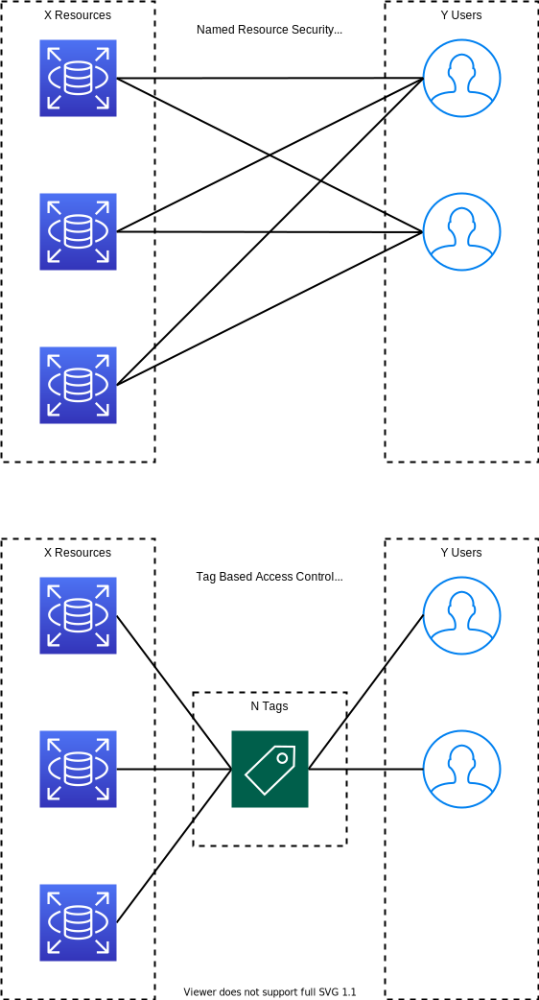

.. _aws-lake-formation-data-access-control-tutorial:

Data Access Control in Lake Formation Tutorial
==============================================================================

.. contents::
    :depth: 1
    :local:

The Nature of Data Access Control
------------------------------------------------------------------------------

Key Concept:

- **Resource**: a data resource, can be database, table, column, file, etc ...
- **Principal**: a data visitor, can be a human, machine, IAM User, IAM Role, etc ...

``Data Access Control`` is all about grant a ``Principal`` to access specific ``Resource``::

    [User] --- access ---> [Database Table]

In AWS World, Lake Formation supports AWS Glue Catalog database / table / column as Resource, IAM User / Role as Principal. Since you can use AWS Glue Catalog to connect to different data source system, such as S3, JDBC database connection, salesforce, etc, you can visit almost anything

Data Access Model in Lake Formation
------------------------------------------------------------------------------

- **Named data catalog resources security**: Grant / Revoke a Principal access to a Resource. This is very similar to the legacy AWS Glue Catalog Resource Policy, and also the default model in old AWS Lake Formation.
- **Lake Formation Tag security model**: Define key value pair as Tag, associate one or multiple tag to ``Resource`` and ``Principal``. ``Principal`` automatically gain access to ``Resource`` that matching the Tag. This is very similar to IAM User Group. Define what resources a IAM User Group can access. If a User belongs to a Group, it automatically get the access to those resources.

Pro and Con:

- **Named data catalog resources security**
    - pro:
        - intuitive, easy to understand
    - con:
        - not scale
- **Lake Formation Tag security model**
    - pro:
        - scalable
    - con:
        - harder learning curve

Explain:

If there are X ``Resource`` and Y ``Principal``. With ``Named data catalog resources security`` you need to declare X * Y access policy. With ``Lake Formation Tag security model`` you only need to associate tags to X ``Resource`` and Y ``Principal`` (X + Y).

Example, a financial institution has 5 database, 50 tables, and 20 human and machine users. You have 6 access roles that can access different database / tables. Total effort needed:
    - Named data catalog resources security: 50 * 20 = 1,000
    - Lake Formation Tag security model: (50 + 20) * 6 = 420

LF Tag Strategy
------------------------------------------------------------------------------

Assume that you have 3 different user groups: admin, regular, limited. Then you need to define 6 LF tags:

    Admin = Y
    Admin = N
    Regular = Y
    Regular = N
    Limited = Y
    Limited = N

If you want a resource can be visited by Admin, then give it ``Admin = Y``, otherwise give it ``Admin = N`` or do nothing.

If you want a user to be Admin, then give it ``Admin = Y``  or do nothing.

The resource hierarchy is Database -> Table -> Column from top to bottom. Table automatically inherit tags from Database, Column inherit tags from Table.

Row Level Access in Lake Formation
------------------------------------------------------------------------------

If you have a Catalog Table, then you can create a Athena View using a SQL query like ``SELECT * FROM table WHERE confidential = False``. Athena View is actually just another Catalog Table. You just grant the user who need limited row access a permission to visit that view.

LF Tag based Data Access Control Hands On Practice
------------------------------------------------------------------------------

**Use Case**:

We have:

- one database: ``eshop``
- three table:
    - ``users``
        - ``user.user_id: str``
        - ``user.email: str``
        - ``user.ssn: str``
        - ``user.confidential: int``
    - ``items``
        - ``items.item_id: str``
        - ``items.item_name: str``
        - ``items.price: number``
    - ``orders``
        - ``orders.order_id: str``
        - ``orders.buyer_id: str``
        - ``orders.items: array[struct]``: ``[{"item_id": "item-2", "count": 1}, ...]``
- three different user groups:
    - ``admin``: can access everything.
    - ``regular``: cannot see ``users.ssn``.
    - ``limited``: can only access ``orders``, ``users.user_id``, ``users.user_email`` and cannot see data that ``users.confidential = 1``.

**IAM Role**

- Lake Formation Admin IAM User (or assumed role)
- AWS Glue Crawler service role
    - Policy: ``AWS Glue Service Role``, ``S3 read only for data bucket``
- User Group ``admin`` assumed role
    - Policy: ``Athena Full Access``, ``Athena Result S3 read/write access``
- User Group ``regular`` assumed role
    - Policy: same as above
- User Group ``limited`` assumed role
    - Policy: same as above

**Prepare S3 Data**

Upload ``eshop`` to AWS S3.

**Understand Lake Formation Console**

- Dashboard
- **Data catalog**
    - **Databases**: catalog databases dashboard
    - **Tables**: catalog tables dashboard
    - **Settings**: lake formation settings
- **Register and ingest**
    - **Data lake locations**: register a s3 location as data location
    - Blueprints: packaged data source connector, etl, data lake solution
    - Crawlers: glue crawler console
    - Jobs: glue job console
- **Permissions**
    - **Administrative roles and tasks**: choose LF admin, choose database creator
        - **LF-Tags**: define LF Tags
        - **LF-tag permissions**: define who can create and access (grant/revoke) what LF Tags
    - **Data lake permissions**: data access aggregated dashboard
    - **Data locations**: who can update glue catalog pointing to which registered data location
    - External data filtering: EMR

**Configure Data Access in Lake Formation**

Populate Tables

1. Choose Admin
2. Register Data Location for ``eshop`` folder
3. Create a Database
4. Grant Data location permission: Allow ``AWS Glue Crawler Service Role`` to create/update table pointing to the ``eshop`` data location
5. Create and Run Glue Crawler, create three tables ``users``, ``items``, ``orders``.

Config LF Tag

1. go to **LF-Tags** menue, create six LF Tags for three defined user group: ``Admin = Y, Admin = N, Regular = Y, Regular = N, Limited = Y, Limited = N``

Configure Principal

1. go to **Data Lake Permission**: give three User Group assumed role LF-Tags accordingly.

Configure Resource

Note:

    - ``admin``: can access everything.
    - ``regular``: cannot see ``users.ssn``.
    - ``limited``: can only access ``orders``, ``users.user_id``, ``users.user_email`` and cannot see data that ``users.confidential = 1``.

1. go to **Databases** give it ``Admin = Y`` and ``Regular = Y``, all table and column will inherit this tag
2. go to **Table** give ``orders``, ``users`` table ``Limited = Y``.
3. set ``users.ssn: Regular = N``, ``users.ssn: Limited = N``, ``users.type: Limited = N``.

Test Query in Athena

1. Test query
2. create view to enable row level access
3. give Athena View Table LF-Tag
4. test on View Table
