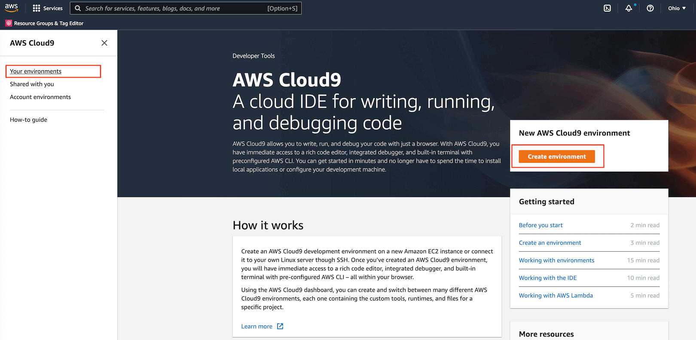
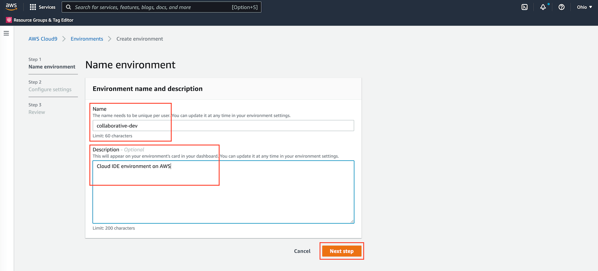
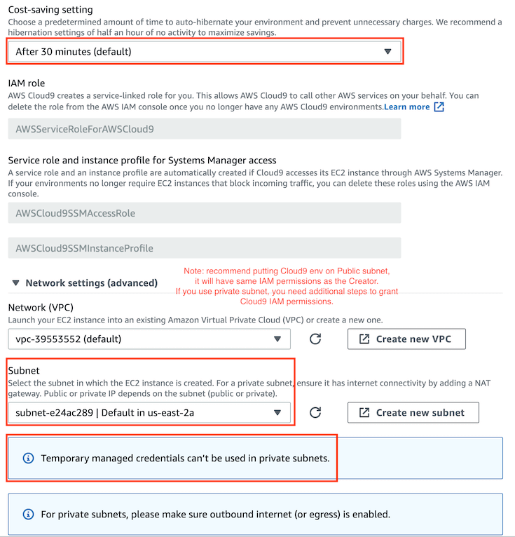
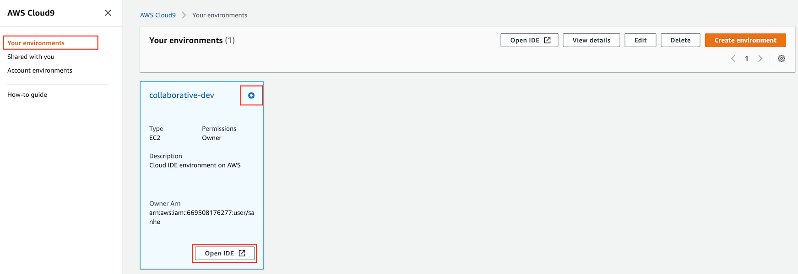

.. _set-up-cloud9-development-environment:

Set up cloud9 development environment
==============================================================================
Keywords: AWS, Cloud9 Cloud 9, Collaborative Dev Development Environment

.. contents::
    :class: this-will-duplicate-information-and-it-is-still-useful-here
    :depth: 1
    :local:

1. Create Cloud 9 Environment
------------------------------------------------------------------------------
The native of Cloud 9 environment is just a EC2 virtual machine in your AWS environment on VPC. Follow this document to create your environment.

- Creating an EC2 Environment: https://docs.aws.amazon.com/cloud9/latest/user-guide/create-environment-main.html

.. image:: ./img/cloud9-1.png

.. image:: ./img/cloud9-4.png

2. Use Cloud 9 IDE
------------------------------------------------------------------------------
Things to know:

- Top main menu: classic IDE liked menu.
- Left side tool menu: search anything, file explorer, SVC tool, AWS explorer.
- File explorer: create / edit / rename / move / delete file and folder, show hidden files.
- Code Editor: hot key for save / comment / close tab / etc ...
- Terminal: a local terminal with bash shell, you can use other shells too.
- AWS Credential Management: manage the AWS access for your Cloud 9 VM.
- Use EC2 instance Profile when using Cloud 9 in Private subnet: the AWS Managed credential won't work when Cloud 9 is on Private subnet. You should consider using EC2 instance profile.

.. image:: ./images/cloud9-7.png

Reference:

- Working with IDE: https://docs.aws.amazon.com/cloud9/latest/user-guide/ide.html

.. _use-aws-cloud9-with-github:

3. Use AWS Cloud 9 with Github
------------------------------------------------------------------------------
This tutorial shows how to securely pull and push a Private Github Repository on AWS Cloud 9.

1. Generate a GitHub personal access token (GitHub recommended way) for Authentication:

    Go to GitHub -> Settings -> Developer Settings -> Personal access token -> Create one token -> grant the token Repo Read / Write access -> Store it securely.

2. Clone the Repo:

.. code-block:: bash

    # Store token in a variable, so you don't need to copy and paste it insecurely
    GH_TOKEN="abcd1234...."

    # Clone the Repo with the Token
    git clone https://${GH_TOKEN}@github.com/your-github-account-name/your-repo-name.git

3. Pull latest Code (Skip this if you prefer git cmd):

    There's a Git VCS ICON on your left top tool bar. You can see the cloned repo there.

    There's a Git Sync ICON on your left bottom tool bar. You can click to sync (Push and Pull) the code to / with remote.

3. Make change and Commit (Skip this if you prefer git cmd):

    Go to Git VCS menu, click on the ``+`` near the ``Change`` menu to add changes to git. It is ``git add`` equivalent.

    Enter commit message in the message box, click on the icon near your repo name, choose commit. Or you can just go to terminal and do ``git commit -m "your commit message"``

4. Push to Remote:

    Just click the Git Sync ICON, or ``git push``

5. Manage branch:

    There's a Git Branch Icon on your left bottom tool bar. You can create / delete / switch branch in the branch menu.

4. Use AWS Cloud 9 with AWS Code Commit
------------------------------------------------------------------------------
See :ref:`use-code-commit-repo-on-aws-cloud9-or-jupyter-lab`

5. Setup Python Development Environment in Cloud 9
------------------------------------------------------------------------------
You can do the develop from your local MAC laptop. For windows computer, some linux command may not work properly.

Another easy way is to create a AWS Cloud 9 dev environment, it is a cloud IDE environment on a EC2 virtual machine. It only takes a few clicks and a few minutes to create one, so you can start development from any computer. You can find a `simple AWS Cloud 9 tutorial here <https://github.com/MacHu-GWU/aws_dla_opensearch_examples#set-up-development-environment-using-aws-cloud-9>`_

1. Check your current system Python and virtualenv CLI

.. code-block:: bash

    # show full path of python interpreter
    which python

    # show python version
    python --version

    # show full path of virtualenv cli
    which virtualenv

2. Clone this repo and CD into it

.. code-block:: bash

    # clone the repo
    git clone https://github.com/MacHu-GWU/aws_dla_opensearch_examples.git

    # cd into the repository root directory
    cd ./aws_dla_opensearch_examples

3. Create virtualenv:

.. code-block:: bash

    # create virtualenv
    virtualenv venv

    # activate the virtualenv, you should see (venv) at begin
    source ./venv/bin/activate

    # pip install learn_opensearch package on your local
    # you can make your code importable from virtual env
    pip install -e .

4. Configure Runner to use virtualenv python.

Cloud 9 top menu -> Run -> Run With -> New Runner

.. code-block:: javascript

    // Create a custom Cloud9 runner - similar to the Sublime build system
    // For more information see http://docs.aws.amazon.com/console/cloud9/create-run-config
    {
        "cmd" : ["/home/ec2-user/environment/aws_dla_opensearch_examples/venv/bin/python", "$file", "$args"],
        "info" : "Started $project_path$file_name",
        "env" : {},
        "selector" : "source.ext"
    }
