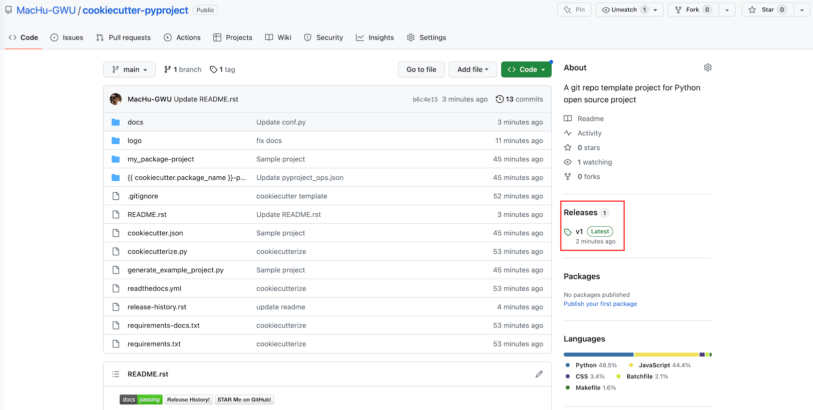
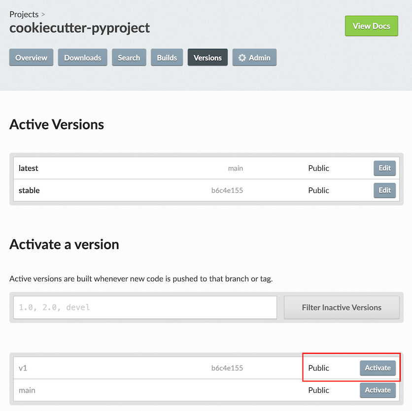
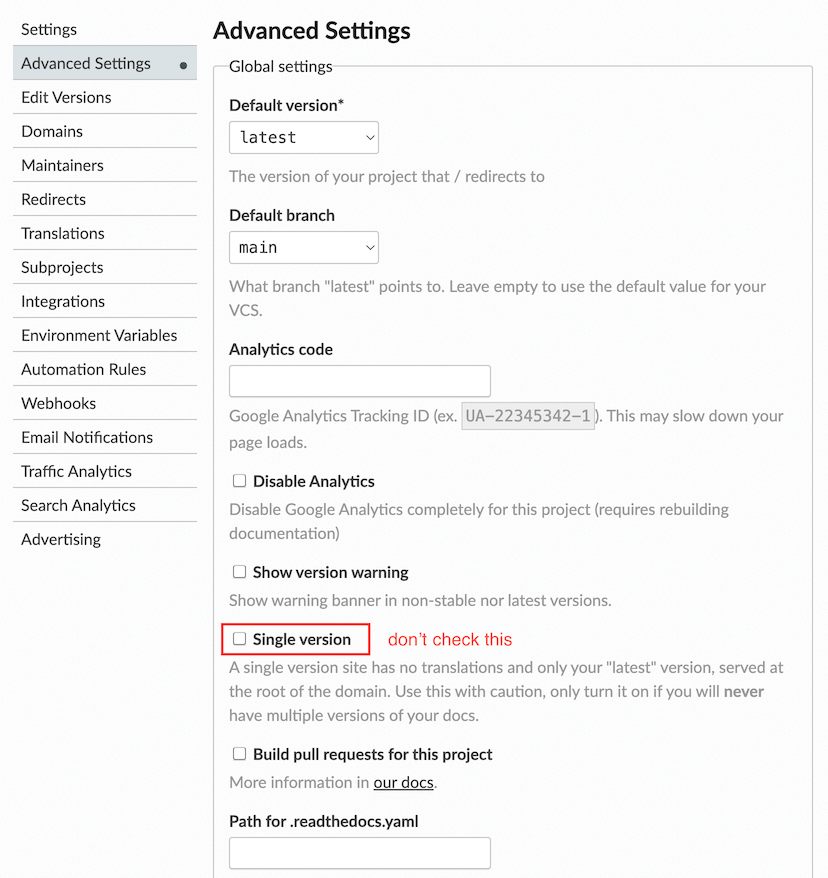
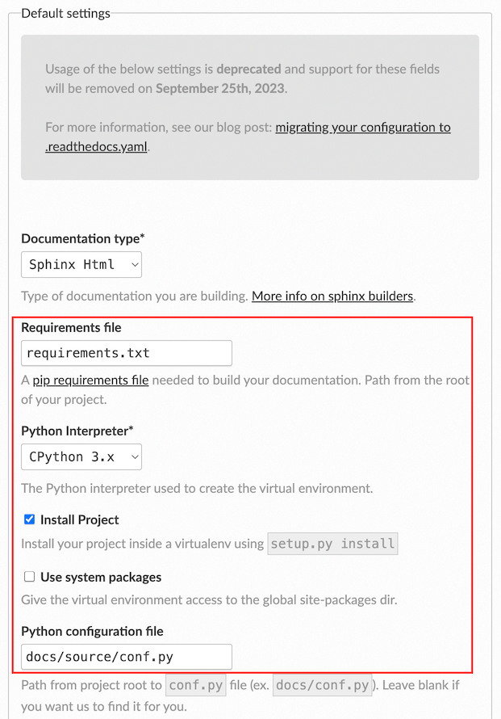

Host Your Docs on ReadTheDocs For OpenSource Project
==============================================================================
Keywords: ReadTheDocs, Read, The, Doc, Docs

Read The Docs Org
------------------------------------------------------------------------------
`ReadTheDocs (RTD) <https://readthedocs.org/>`_ 是一个为开源项目免费提供文档构建和部署服务的网站, 同时它也为企业提供了付费服务. Python 社区大部分的开源项目的文档都 host 在这个网站上.

Enable Versioned Doc
------------------------------------------------------------------------------
对于一个版本不断更新的开源项目, 为不同版本保留历史文档也是非常重要的. RTD 自带这个功能.

它的工作原理是你需要为每个版本打上 Git Tag, 然后在 RTD 的 Console 中的 Versions 一栏里就可以开启这个版本. 只要你的 Python 项目版本和 Git Tag 保持一致, RTD 就可以为你维护所有的历史版本. 具体配置如下:

Reference:

- `Versioned documentation <https://docs.readthedocs.io/en/stable/versions.html>`_

``.readthedocs.yaml``
------------------------------------------------------------------------------
早期的 RTD 系统的配置都是在网站的 Console 里进行的. 2018 年前后开始推行用 yml 配置文件来控制项目的构建, 这也符合比较现代的做法. 从 2023 年 9 月起, Console 里的 config 将不再支持了.

- `Configuration file v2 <https://docs.readthedocs.io/en/stable/config-file/v2.html>`_
- `Migrate your project to .readthedocs.yaml configuration file v2 <https://blog.readthedocs.com/migrate-configuration-v2/>`_

Python 项目文件结构
------------------------------------------------------------------------------
可以参考这个模板项目. 我所有带文档的开源项目都是用这个模板生成的. 其中最重要的是以下三个文件.

- `requirements-doc.txt <https://github.com/MacHu-GWU/cookiecutter-pyproject/blob/main/%7B%7B%20cookiecutter.package_name%20%7D%7D-project/requirements-doc.txt>`_
- `docs/source/conf.py <https://github.com/MacHu-GWU/cookiecutter-pyproject/blob/main/%7B%7B%20cookiecutter.package_name%20%7D%7D-project/docs/source/conf.py>`_
- `readthedocs.yml <https://github.com/MacHu-GWU/cookiecutter-pyproject/blob/main/%7B%7B%20cookiecutter.package_name%20%7D%7D-project/readthedocs.yml>`_
