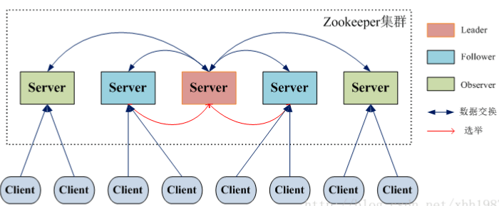

Zookeeper
==============================================================================

本文档是对经典文章 `可能是全网把 ZooKeeper 概念讲的最清楚的一篇文章 <https://segmentfault.com/a/1190000016349824>`_ 的一个更精炼的提炼.

.. contents::
    :depth: 1
    :local:

Zookeeper 的由来
------------------------------------------------------------------------------

雅虎的开发人员就试图开发一个通用的无单点问题的分布式协调框架, 以便让开发人员将精力集中在处理业务逻辑上.

简单来说, 大部分分布式系统都需要有一个 Master 节点进行调度, 但是 Master 节点本身是一个单点故障的隐患. Zookeeper 本身使用冗余和集群实现了一个虚拟的, 高可用, 强一致 (强一致很重要) Master 节点.

ZooKeeper 概览
------------------------------------------------------------------------------

ZooKeeper 的设计目标是将那些复杂且容易出错的分布式一致性服务封装起来, 构成一个高效可靠的原语集, 并以一系列简单易用的接口提供给用户使用.

    **原语**: 操作系统或计算机网络用语范畴. 是由若干条指令组成的, 用于完成一定功能的一个过程. 具有不可分割性·即原语的执行必须是连续的, 在执行过程中不允许被中断. 

ZooKeeper 是一个典型的 **分布式数据一致性解决方案**, 分布式应用程序可以基于 ZooKeeper 实现诸如数据发布/订阅, 负载均衡, 命名服务, 分布式协调 / 通知, 集群管理, Master 选举, 分布式锁和分布式队列等功能.

Zookeeper 一个最常用的使用场景就是 **用于担任服务生产者和服务消费者的注册中心**. 服务生产者将自己提供的服务注册到Zookeeper中心, 服务的消费者在进行服务调用的时候先到Zookeeper中查找服务, 获取到服务生产者的详细信息之后, 再去调用服务生产者的内容与数据. 如下图所示, 在 Dubbo架构中 Zookeeper 就担任了注册中心这一角色.

**为什么最好使用奇数台服务器构成 ZooKeeper 集群?**

我们知道在Zookeeper中 Leader 选举算法采用了Zab协议. Zab核心思想是当多数 Server 写成功, 则任务数据写成功.

- 如果有3个Server, 则最多允许1个Server 挂掉.
- 如果有4个Server, 则同样最多允许1个Server挂掉.

既然3个或者4个Server, 同样最多允许1个Server挂掉, 那么它们的可靠性是一样的, 所以选择奇数个ZooKeeper Server即可, 这里选择3个Server.

ZooKeeper 特点
------------------------------------------------------------------------------

- 顺序一致性: 从同一客户端发起的事务请求, 最终将会严格地按照顺序被应用到 ZooKeeper 中去. 
- 原子性: 所有事务请求的处理结果在整个集群中所有机器上的应用情况是一致的, 也就是说, 要么整个集群中所有的机器都成功应用了某一个事务, 要么都没有应用. 
- 单一系统映像 : 无论客户端连到哪一个 ZooKeeper 服务器上, 其看到的服务端数据模型都是一致的. 
- 可靠性: 一旦一次更改请求被应用, 更改的结果就会被持久化, 直到被下一次更改覆盖. 

ZooKeeper 集群角色介绍
------------------------------------------------------------------------------

最典型集群模式: Master/Slave 模式（主备模式）. 在这种模式中, 通常 Master服务器作为主服务器提供写服务, 其他的 Slave 服务器从服务器通过异步复制的方式获取 Master 服务器最新的数据提供读服务. 

但是, 在 ZooKeeper 中没有选择传统的 Master/Slave 概念, 而是引入了Leader, Follower 和 Observer 三种角色. 如下图所示:

ZooKeeper 集群中的所有机器通过一个 Leader 选举过程来选定一台称为 “Leader” 的机器, Leader 既可以为客户端提供写服务又能提供读服务. 除了 Leader 外, Follower 和 Observer 都只能提供读服务. Follower 和 Observer 唯一的区别在于 Observer 机器不参与 Leader 的选举过程, 也不参与写操作的“过半写成功”策略, 因此 Observer 机器可以在不影响写性能的情况下提升集群的读性能. 

- Leader: 负责进行投票的发起和决议, 更新系统状态
- Follower: 接收客户端请求并向客户端返回结果, 在选举过程中参与投票
- Observer: 接收客户端连接, 将写请求转发给 leader, 但 observer 不参与投票过程, 之同步 leader 的状态. Observer 的目的是扩展系统, 提高读取速度.

ZAB 协议 Paxos算法
------------------------------------------------------------------------------

**ZAB 协议两种基本的模式: 崩溃恢复和消息广播**

ZAB协议包括两种基本的模式, 分别是 崩溃恢复和消息广播. 当整个服务框架在启动过程中, 或是当 Leader 服务器出现网络中断, 崩溃退出与重启等异常情况时, ZAB 协议就会进人恢复模式并选举产生新的Leader服务器. 当选举产生了新的 Leader 服务器, 同时集群中已经有过半的机器与该Leader服务器完成了状态同步之后, ZAB协议就会退出恢复模式. 其中, 所谓的状态同步是指数据同步, 用来保证集群中存在过半的机器能够和Leader服务器的数据状态保持一致. 

当集群中已经有过半的Follower服务器完成了和Leader服务器的状态同步, 那么整个服务框架就可以进人消息广播模式了.  当一台同样遵守ZAB协议的服务器启动后加人到集群中时, 如果此时集群中已经存在一个Leader服务器在负责进行消息广播, 那么新加人的服务器就会自觉地进人数据恢复模式:找到Leader所在的服务器, 并与其进行数据同步, 然后一起参与到消息广播流程中去. 正如上文介绍中所说的, ZooKeeper设计成只允许唯一的一个Leader服务器来进行事务请求的处理. Leader服务器在接收到客户端的事务请求后, 会生成对应的事务提案并发起一轮广播协议；而如果集群中的其他机器接收到客户端的事务请求, 那么这些非Leader服务器会首先将这个事务请求转发给Leader服务器. 

关于 **ZAB 协议 Paxos 算法** 需要讲和理解的东西太多了, 说实话, 笔主到现在不太清楚这俩兄弟的具体原理和实现过程. 推荐阅读下面两篇文章:

- 图解分布式一致性协议Paxos: http://codemacro.com/2014/10/15/explain-poxos/
- Zookeeper ZAB协议分析: https://www.jianshu.com/p/e689e67d1f7b
