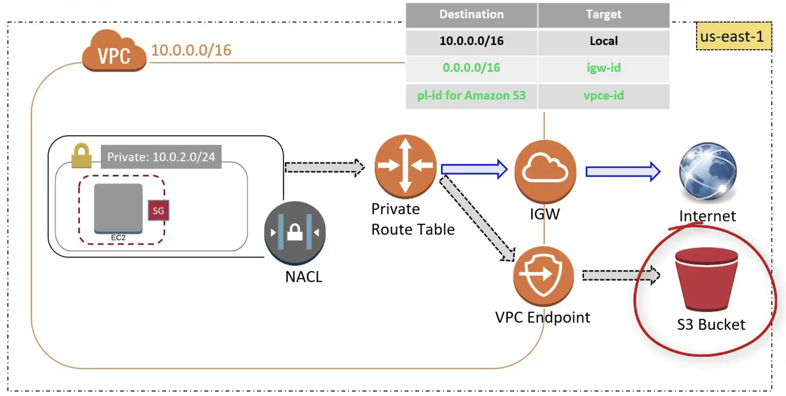

VPC Endpoint
============

Reference: https://docs.aws.amazon.com/vpc/latest/userguide/vpc-endpoints.html

A VPC endpoint enables you to privately connect your VPC to supported AWS services and VPC endpoint services powered by PrivateLink without requiring an internet gateway, NAT device, VPN connection, or AWS Direct Connect connection. Instances in your VPC do not require public IP addresses to communicate with resources in the service. Traffic between your VPC and the other service does not leave the Amazon network.

简单来说, Endpoint 是用于允许 VPC 内部的机器, 不通过 Internet Gateway, NAT Gateway, Direct Connect, 也就是不通过公网, 直接用一个 Private Link (Endpoint) 来访问其他亚马逊服务. 而这部分的网络流量, 从头到尾都没有离开过 Amazon 的网络. 使得 ``速度更快``, ``更安全``. 例如 VPC 内部的 EC2 和 Lambda 与 S3 通信时就可以这样做.

简单来说, VPC 内部的 EC2 访问 S3 通常需要通过 Nat Gateway 跟位于公网的 S3 API Endpoint 交互. 而 VPC Endpoint 则是为当前 VPC 创建了一个虚拟的 S3 API Endpoint.

VPC Endpoint 有两种类型:

1. Interface Endpoint: An elastic network interface with a **Private IP address** serves as an entry point. e.g. CloudFormation, CloudWatch.
2. Gateway Endpoint: A gateway is a target for specified route in your **route table**. e.g. S3, DynamoDB.

所有支持 VPC Endpoint 的 AWS Resource 的列表, 以及他们的 VPC Endpoint 类型. https://docs.aws.amazon.com/vpc/latest/userguide/vpc-endpoints.html

例子, 使用 VPC Endpoint 访问 S3
------------------------------------------------------------------------------

