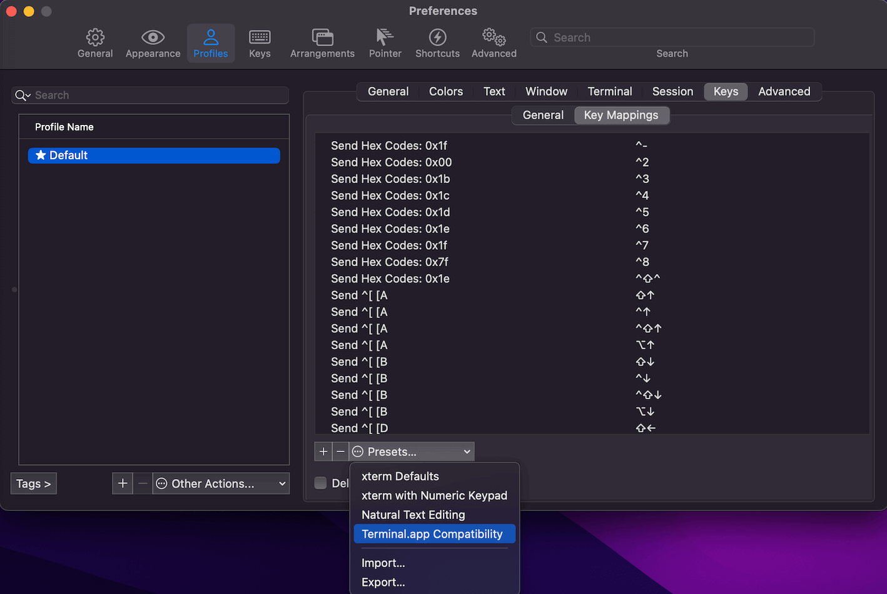

.. _iterm2-root:

iTerm2 Root
==============================================================================

- Clean Up Line: ``Ctrl + A`` + ``Ctrl + K``
- Cancel the Current Command: ``Ctrl + C``
- Copy Text: Just Click

.. contents::
    :class: this-will-duplicate-information-and-it-is-still-useful-here
    :depth: 1
    :local:

Use MacOS native Terminal App Compatible Keybinding
------------------------------------------------------------------------------
iTerm2 natively use xTerm compatible Keybinding preset. By default it doesn't have ``Alt + Left`` and ``Alt + Right`` to move cursor between words. You can enable MacOS native Terminal App Compatible Keybinding by doing this:

- ``CMD + ,`` Enter Preference -> ``Profiles`` Tab -> ``Keys`` Tab -> ``Key Mappings`` -> ``Presets`` = Terminal.app Compatibility.

